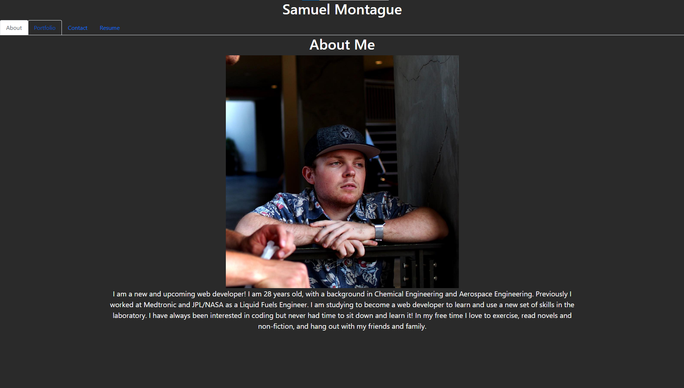
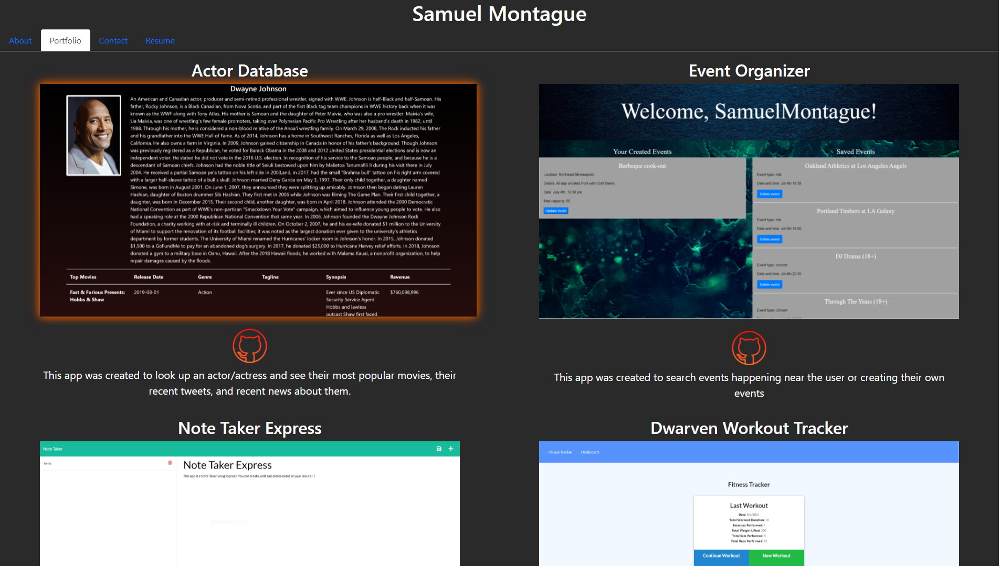
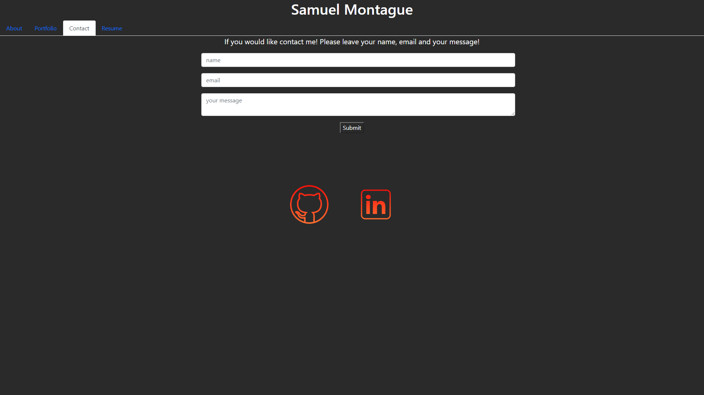
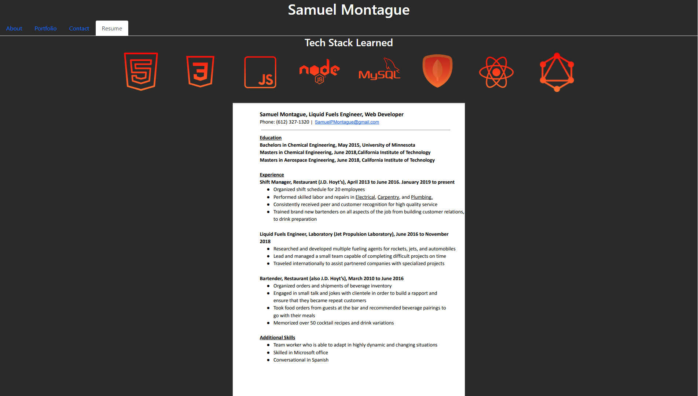

# Sam Montague's React Portfolio

  
# Description

This is my portfolio that I have built using react! In my portfolio, the user can visit my about me, my projects I have, create a message to contact me, or checkout my resume!

Deployed: https://samuelmontague.github.io/reactPortfolio/

 
 
 
 

    
# Table of Contents

* [Installation](#installation)
    
* [Usage](#usage)

* [License](#license)

* [Contributing](#contributing)

* [Tests](#tests)

* [Questions](#questions)
    
# Installation

The following necessary dependcies must be installed to run the application properly: react, react-bootstrap, react-dom.

# Usage

This application will be used as my portfolio to show off my skills and past projects to futre employers. 

# License

This application is covered by the MIT license.
    
# Contributing

Contributors: Samuel Montague

# Tests

To run tests, run the following command: npm run test.
    
# Questions

If you have any questions about the repo, open an issue or contact me directly at SamuelpMontague@gmail.com. You can find more of my work at (https://github.com/SamuelMontague/).